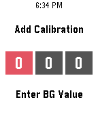

# xDrip-calibrate-pebble

A pebble app that lets you enter in calibrations without the need for opening the app on the uploader device.

Note: This project is currently in progress and the code on the master branch is not fully functional yet.
